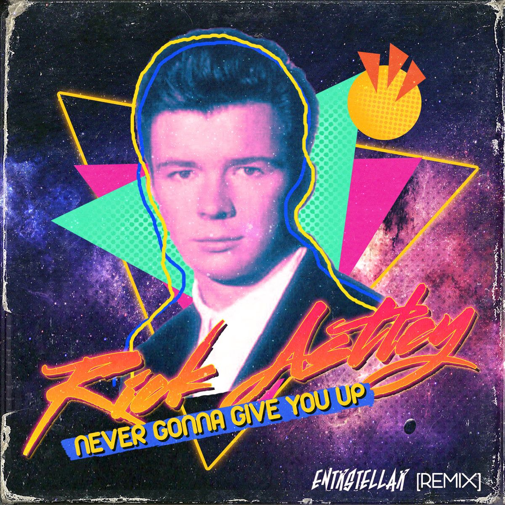
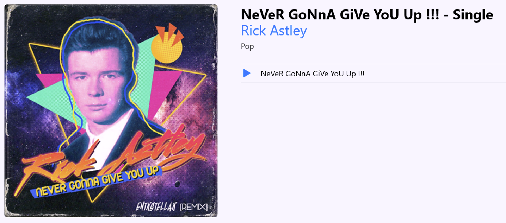

# YTToAppleMusic

## How to use (Local version)

1. Clone the repository
2. Run the virtual environment by running `python -m venv venv` and then `venv\Scripts\activate` on Windows or `source venv/bin/activate` on MacOS/Linux
3. Run `pip install -r requirements.txt`
4. Fill in those values in the `main.py` file
```python
video = "https://www.youtube.com/watch?v=dQw4w9WgXcQ"
title = "NeVeR GoNnA GiVe YoU Up !!!"
artist = "Rick Astley"
genre = "Pop"
```
Here is the custom song cover I will use for this example:
<p align="center">
  
</p>

1. Put the song cover in the `image` folder (make sure it is a `.jpg` file and the aspect ratio is 1:1)
2. Save the file and run the `main.py`
3. The script will download the video, convert it to an audio file and add the metadata into the audio file

The next thing to do is to add the song to your Apple Music library. You can do this by opening the Apple Music / iTunes app on your computer and dragging the song into the app. The song will be added to your library and you can listen to it on all your devices.

## Preview 

Here is a preview of the song in my Apple Music library:
<p align="center">
  
</p>

## How to use (Server version)

Not working yet...