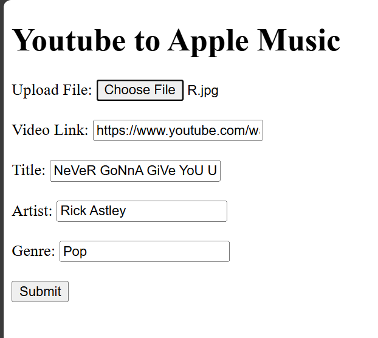

# YTToAppleMusic

## Description

This is a python script that allows you to choose a song/podcast from youtube and add it to your Apple Music library. The script will download the video, convert it to an audio file, add the metadata into the audio file and then add it to your iTunes library so you can listen to it on your Apple Music library. 

This project has been made for Windows and hasn't been tested on other operating systems.

## Setup
1. Clone the repository
2. Run the virtual environment by running 
```bash   
python -m venv venv
```
and 
```bash
venv\Scripts\activate
```
3. Install the packages: 
```bash
pip install -r requirements.txt
```
4. You need to have iTunes installed on your computer
5. Put your iTunes library path in the `main.py` file at line 12
```python
itunes_folder = r"C:\Users\user\Music\iTunes\iTunes Media\Automatically Add to iTunes"
```

## How to use 

1. Create a new file called `.env` and fill in the values
```env
USERNAME=yourusername
PASSWORD=yourpassword
```
1. Run the server by running `python server.py`
2. Connect to the server by going to `http://yourlocalip:5000` on your browser if you are on another device, or `http://localhost:5000` if you are on the same device running the server
3. Fill in the values and click on the `Submit` button and make sure the image is a `.jpg` or `.jpeg` file and the aspect ratio is 1:1 or else the image won't get uploaded to the iTunes library
<p align="center">
  
</p>
4. The script will download the video, convert it to an audio file, add the metadata into the audio file and then add it to your iTunes library so you can listen to it on your Apple Music library
   
## Preview 

Here is a preview of the song in my Apple Music library:
<p align="center">
  
</p>

